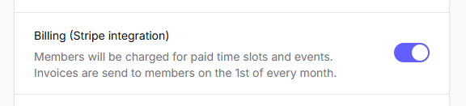
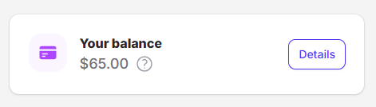

# Billing

PickleTime is integrated with Stripe to collect payments from members.

You can also collect payments by other means if you want, and manually set the payment status of your members.

!!! info "Feature Toggle"

    The Billing feature can be enabled or disabled at any time from the admin dashboard.

    

## Memberships

You can also setup a club membership for your members. Memberships billing is fully integrated.

## Members Ongoing Balance

When a member signs up for an event, like a tournament or a clinic, the [cost](events/events-settings.md#event-cost) is automatically added to their ongoing balance. Think of it like a running tab just for their event fees.

If you receive payments through other methods (like cash or e-transfer), you can manually adjust a member's balance to reflect those payments.

