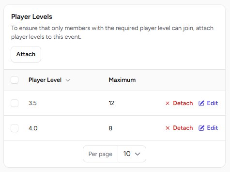
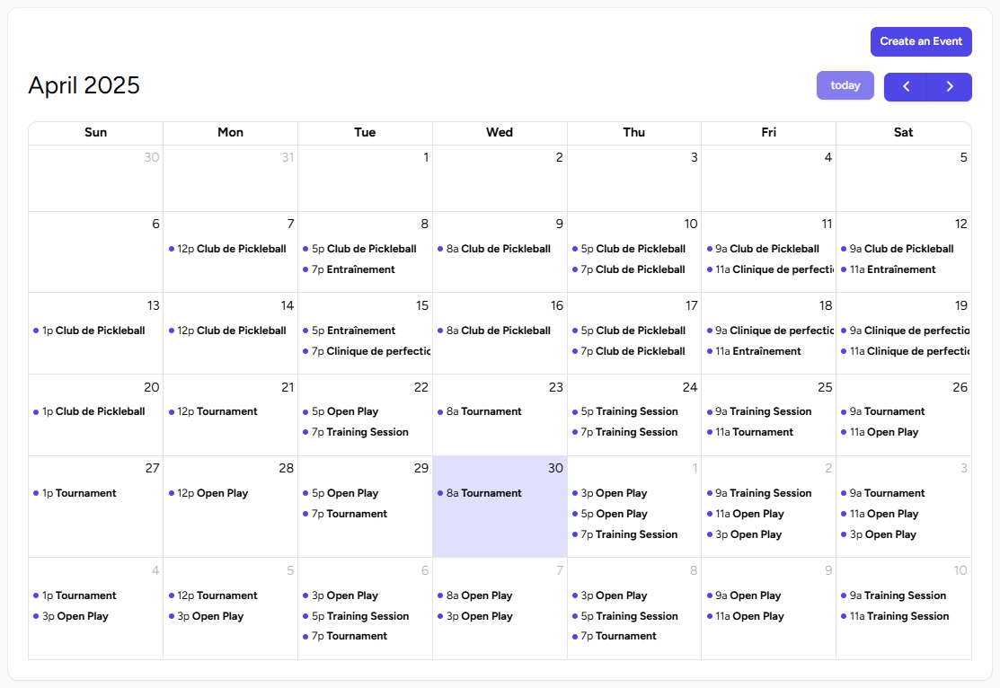
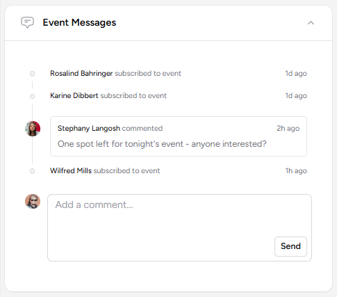
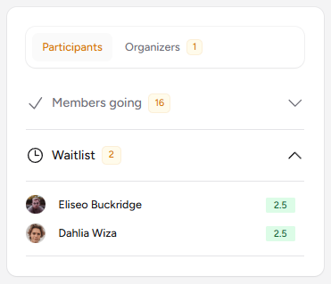

# Events Management

## Important Concepts

* **Season**: A defined period (e.g., "Summer 2025") during which special subscription rules apply. A season can have its pre-season subscriptions "open" or "closed".

* **Event Series**: A recurring event (e.g., "Monday Night Drills"). It can have a cost for season-long subscription.

* **Event**: A single occurrence of an EventSeries on a specific date (e.g., "Monday Night Drills on July 7th, 2025").

## Creating Events

Events are an essential part of managing a pickleball club. With PickleTime, you can efficiently organize and oversee events.

### Event Details

Provide these infos when creating an event:

* **Name**: Enter the name of the event. This field is required.
* **Description**: Add a detailed description to help participants understand the purpose of the event.
Date and Time
* **Start**: Specify the start date and time for the event. This field is required.
* **End**: Specify the end date and time for the event. This field is required.
* **Location**: Choose the event location from the dropdown menu.
* **Maximum**: Set the maximum number of participants allowed for the event. If left blank, there will be no limit on the number of participants.

    !!! info "Player Levels"

        You may also assign [player levels](../members/player-levels.md) to events to restrict who can register.

        Additionally, you can specify a maximum number of participants per player level.

        If the maximum per player level is not defined, the event will still be restricted to that player level but will allow an unlimited number of participants.

        

## :fontawesome-solid-location-dot: Locations

Locations specify where an event will take place. When creating or editing an event, you can select the desired location from the dropdown menu.

!!! info "Updating an event location"

    If the location of an event has changed, participants will be notified of the change to ensure they are aware of the updated details.

## :fontawesome-regular-calendar: Calendar View

The calendar view provides a comprehensive overview of all events, allowing you to see the entire schedule at a glance.

This feature helps you better manage and plan events by displaying them in a clear and organized format.

## :fontawesome-regular-bell: Reminders

Reminders are automatically sent to all members who are attending an event (excluding those on the waitlist) 2 hours before the event starts. This ensures participants are notified and prepared for the event.

## :fontawesome-solid-user-tie: Organizers

Event organizers are members assigned to oversee and manage specific events.

As an organizer, they are responsible for ensuring the event runs smoothly. (1)
{ .annotate }

1. This includes bringing necessary items, such as balls or other equipment, and addressing any issues that arise during the event.

!!! info "Organizers Permissions"
    Organizers also have the authority to cancel an event if necessary, such as in the case of bad weather (e.g., rain) or other unforeseen circumstances.

To add organizers for an event, navigate to the event edit page. From there, you can assign specific members as organizers.

## :fontawesome-regular-comments: Event Chat

The event chat allows participants and waitlisted members to communicate and stay updated about the event. Messages sent to this chat are visible to all attendees, including those on the waitlist.

In addition to messages, the Event Chat also acts as an activity log for the event. It shows informations such as:

* Members who joined or left the event.
* Changes made to the event, such as updates to the location or time.
* If the event is canceled, the reason will be displayed in the Event Chat.

The event chat can also be used to send messages after the event has concluded. (1)
{ .annotate }

1. For example, if a participant finds a lost water bottle, they can post a message to inform everyone who attended the event.

## :fontawesome-regular-hourglass-half: Waitlist

The waitlist feature is enabled by default but can be [disabled](events-settings.md#disable-waitlist) for specific events.

When an event reaches its maximum capacity of participants, additional members can still join, but they are placed on a waitlist.

If a participant withdraws from the event, the next user on the waitlist is automatically moved to the participants list. This ensures that the event remains full while giving waitlisted members a chance to participate.

