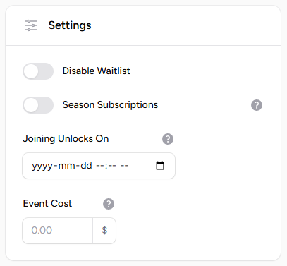
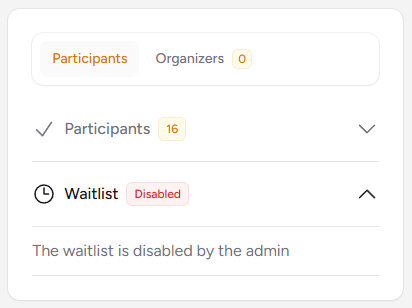

# Events Settings

You may configure event behavior by adjusting the available settings.

## Disable Waitlist

To prevent members from joining a waitlist when an event reaches capacity, you may disable the waitlist feature. With the waitlist disabled, additional members will not be able to subscribe or join a waitlist once the event is full.

## Series Subscriptions

The [Series Subscriptions](recurring-events.md#series-subscriptions) feature is available exclusively for [recurring events](recurring-events.md), allowing for advanced subscription management.

## Joining Unlocks On

You may restrict when users can join an event by specifying an unlock date. Before this date, users attempting to join will see a message indicating when registration will become available.

## Event Cost

When an event cost is specified, all event participants will be charged the indicated amount after the event has occurred.

Exceptions:

* Participants are not charged if the event is canceled.
* Members who remain on the waitlist are not charged.

The event charge will be added to each member's [ongoing balance](../billing.md#members-ongoing-balance).

