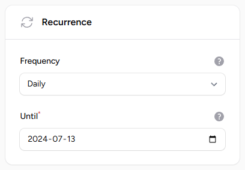
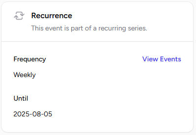
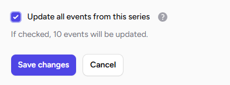
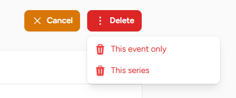
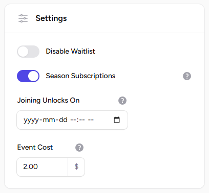
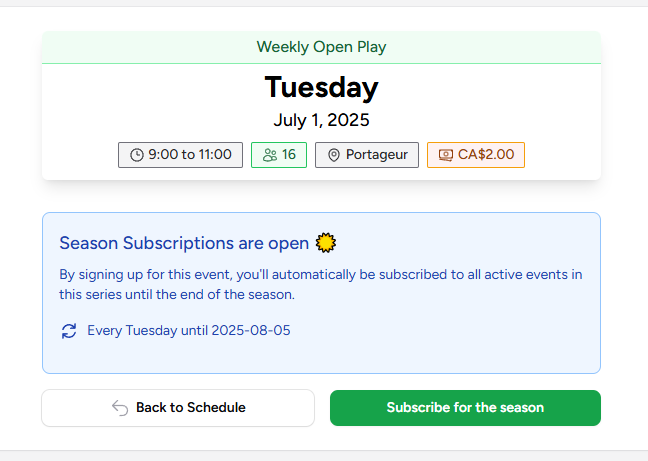

# :fontawesome-solid-rotate: Recurring Events

When creating an event, you may designate it as recurring by selecting the desired frequency.

This action will generate a series of linked events for streamlined management. Each event within the series can be managed independently.

!!! info "Frequency"

    You can choose from the following frequencies:
    
    * Daily
    * Weekly

## Managing Recurring Events

When editing an event that is part of a recurring series, a dedicated section displays all events within the series. This overview allows you to:

- View each occurrence in the series.
- See the number of members subscribed to each event.

This feature helps you track participation and manage individual events within the series more effectively.

### Bulk Edits

After setting up a recurring event, you may need to manage it periodically. The following tasks are common:

* **Editing a Recurring Event**: If modifications are required, you can edit the series. You have the option to update either a single occurrence or the entire series.

    

* **Deleting a Recurring Event**: To remove a recurring event, you may choose to delete a single occurrence or the entire series. Please note that this action is irreversible.

    

## Series Subscriptions

!!! warning "Warning"

    It is recommended to use the new [Seasons](../seasons/index.md) feature instead.

Recurring events can have **Series Subscriptions** enabled. When this option is active, members who join the event are automatically subscribed to all occurrences within the recurring event series.

This feature is ideal when you want members to commit to a specific time slot for the entire season, ensuring consistent attendance and simplifying event management.

When viewing an event with season subscriptions enabled, a notice will be displayed indicating that this event series will occur every week or every specified number of days until a specific end date.

!!! note "Series Subscriptions period"

    You should leave the Series Subscriptions enabled only for a short period, like a week or two, before the season starts. Just enough time so members can pick their time slots for the upcoming season.

    It is recommended to turn off the Season Subscriptions toggle on events once the subscription period has ended.
    That way, after the season has started, members can then join singles events to fill empty slots, or to get on the waitlist.

