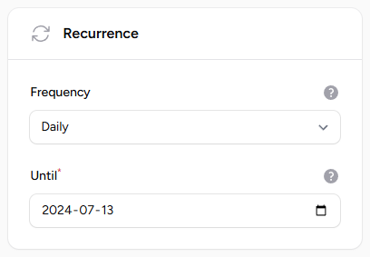
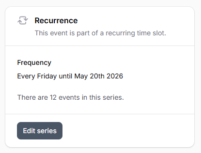
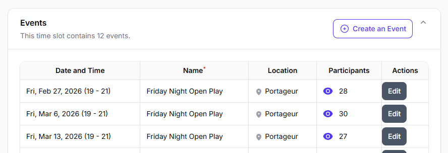

# :fontawesome-solid-rotate: Time Slots

When creating an event, you may designate it as recurring by selecting the desired frequency.

This action will generate a series of linked events for streamlined management. Each event within the time slot can be managed independently.

!!! info "Frequency"

    You can choose from the following frequencies:
    
    * Daily
    * Weekly

## Managing Time Slots

When editing an event that is part of a time slot, a dedicated section displays all events within it. This overview allows you to:

- View each individual event.
- See the number of members subscribed to each event.

This feature helps you track participation and manage individual events within the time slot more effectively.

