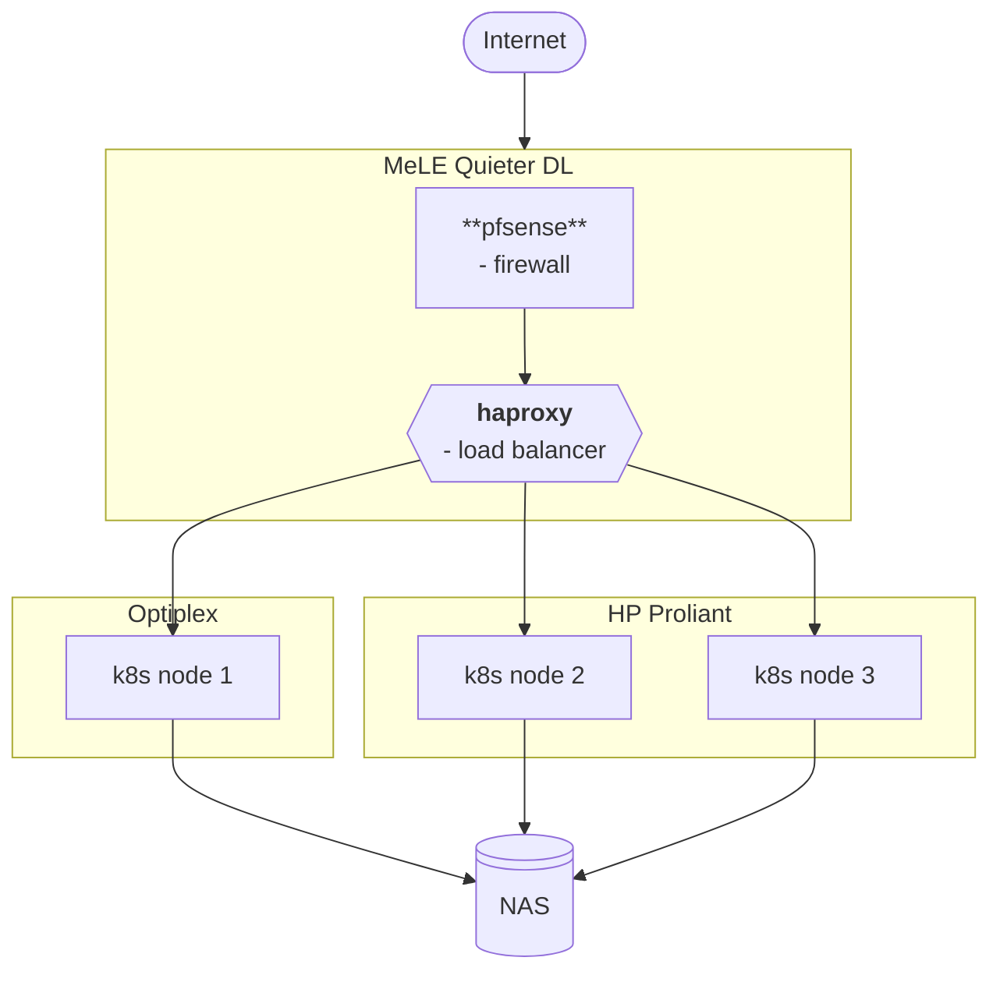

# Network diagram

```mermaid
flowchart TB
    subgraph mele["MeLE Quieter DL"]
    pfsense["**pfsense**<br>- firewall"]
    haproxy@{ shape: hex, label: "**haproxy**<br>- load balancer" }
    pfsense-->haproxy
    end
    subgraph optiplex["Optiplex"]
    ubuntu1["k8s node 1"]
    end
    subgraph proliant["HP Proliant"]
    ubuntu2["k8s node 2"]
    ubuntu3["k8s node 3"]
    end
    
    internet(["Internet"]) --> mele
    haproxy --> ubuntu1 & ubuntu2 & ubuntu3
    ubuntu1 & ubuntu2 & ubuntu3 --> storage
    storage@{ shape: lin-cyl, label: "NAS" }
```

