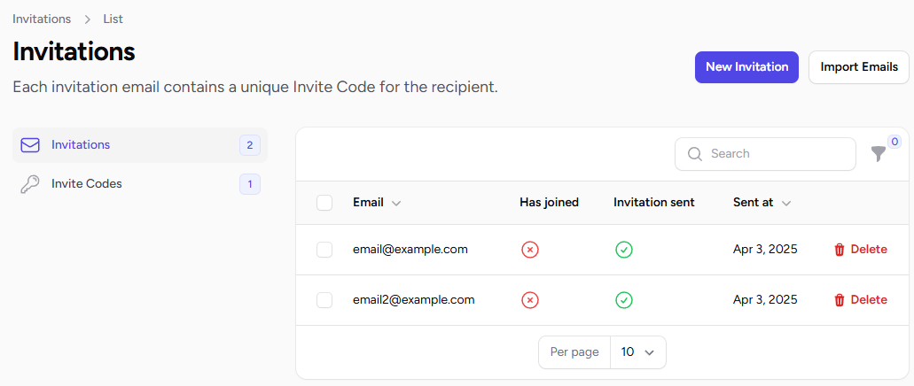
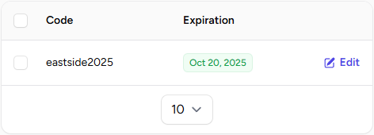

# Members

## Invite Members

You can invite members to your Club by using one of these methods:

### Import a list of emails

You can import a list of emails from a CSV file.
An email with a unique code will be sent to each email in the list.

### Send an invite email

You can create invitations individually by entering an email address.
An email with a unique code will be sent to the specified email.

### Generate an Invite Code

If you don't have an existing list of emails to provide for invitations, you can generate an Invite Code.

You can then share this code with whoever you like. When people registers on your Club page, they will be asked to enter an Invite Code.

You can also set an expiration date on your Invite Codes.

## Extra Fields

You might want to set additional informations on your members.
These types of fields are supported:

* Text
* Boolean (true or false)
* Date

Each extra field can be set as:

* Private