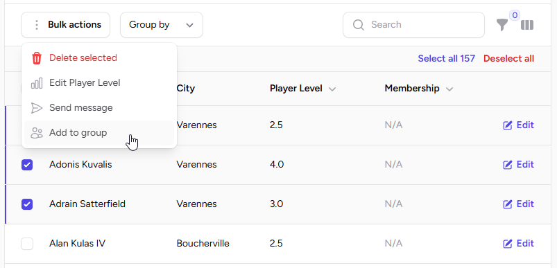

# Groups

Groups allow for easier management of members.

Administrators can send messages to groups, assign groups to events, and create rules within groups.

## Add members to groups

You can add members by selecting them, then from the Bulk Actions button, select "Add to group".

## Rules

You can create rules within groups.

This simplifies management by eliminating the need to handle individual members separately.
