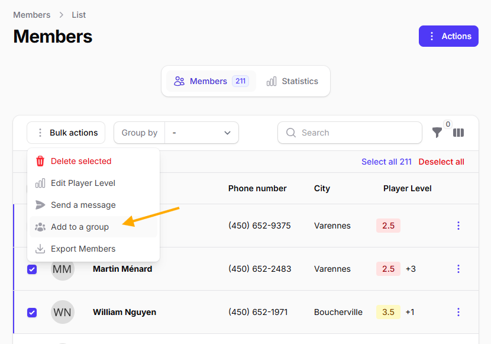
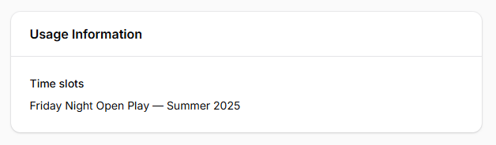

# Groups

Groups allow for easier management of members.

Administrators can send messages to groups, assign groups to events or time slots, and so on.

## Add members to groups

You can add members by selecting them, then from the Bulk Actions button, select "Add to group".

## Group Usage

You can see where the group is being used from the group Edit page.

