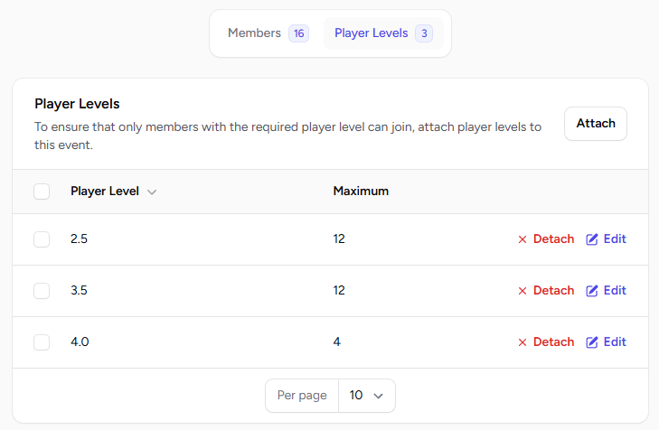
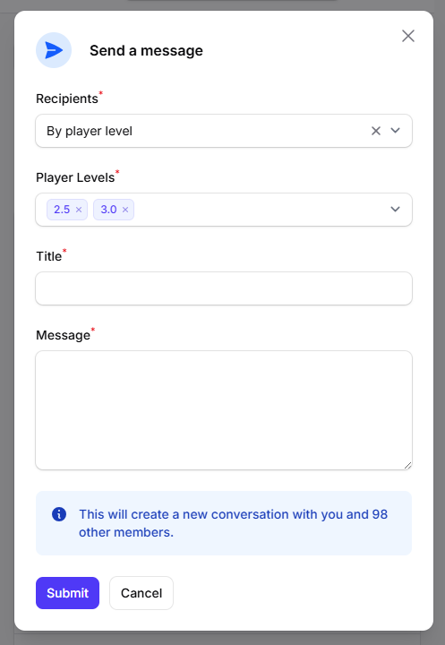

# Player Levels

Player levels are a way to group members into strength categories. These levels help in organizing events and managing communication effectively.

## Examples of Player Levels

Player levels can be customized based on your club's preferences. Common examples include:

- **Skill-based categories**: Beginner, Intermediate, Advanced.
- **DUPR ranking system**: 2.5, 3.0, 3.5, etc.

## Attaching Player Levels to Events

You can attach player levels to events to restrict participation. This ensures that only members within the specified player levels can register for the event.

Additionally, you can define a maximum number of participants per player level. If no maximum is set, the event will still be restricted to the specified player levels but will allow an unlimited number of participants.

## Messaging Specific Player Levels

Player levels can also be used to send targeted messages. For example, you can notify all "Intermediate" players about an upcoming event or share updates relevant to a specific skill group.

