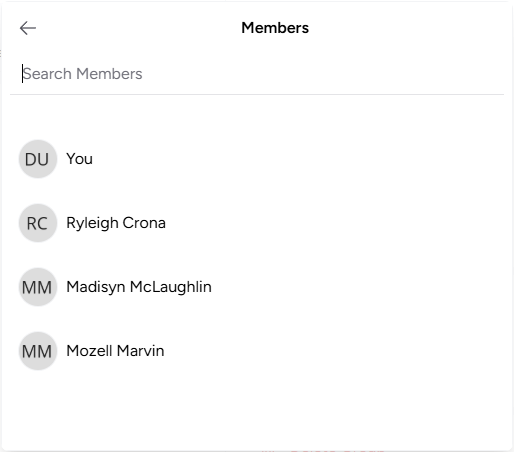
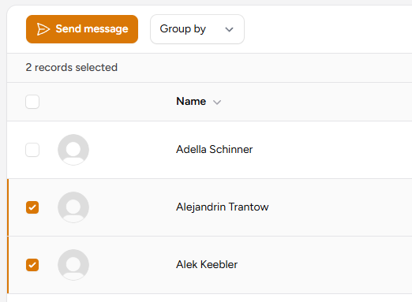
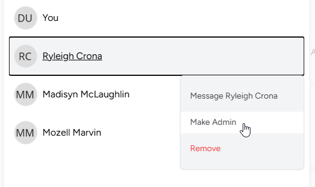
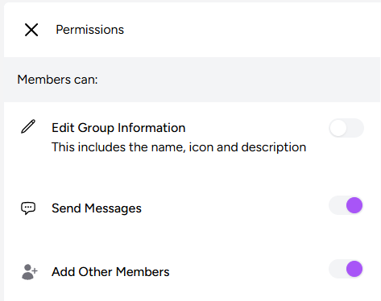
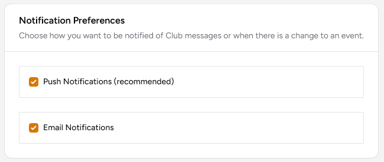

# :fontawesome-regular-comments: Messaging

PickleTime includes a powerful, integrated chat feature designed to enhance collaboration and communication among members.

## Private Chat Groups

Members can create private chat groups to facilitate focused discussions. When a member creates a new chat group, they are automatically assigned as the group admin.

Members can select other members from the members list and send a message to the selected members. This action will create a chat group, allowing all selected members to reply and have a conversation together.

### Group Administration

The group admin has the ability to manage the group effectively:

- **Assign Admin Role:** The group admin can designate another member as an additional admin for the group.

    

- **Manage Members:** Admins can add new members to the group or remove existing members as needed.

This structure ensures that chat groups remain organized and that group membership is always under the control of trusted members.

## Message Notifications

When users receive a new chat message, they are notified according to their chosen preference; either by a push notification or by email.

