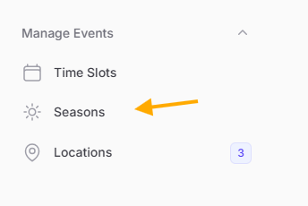
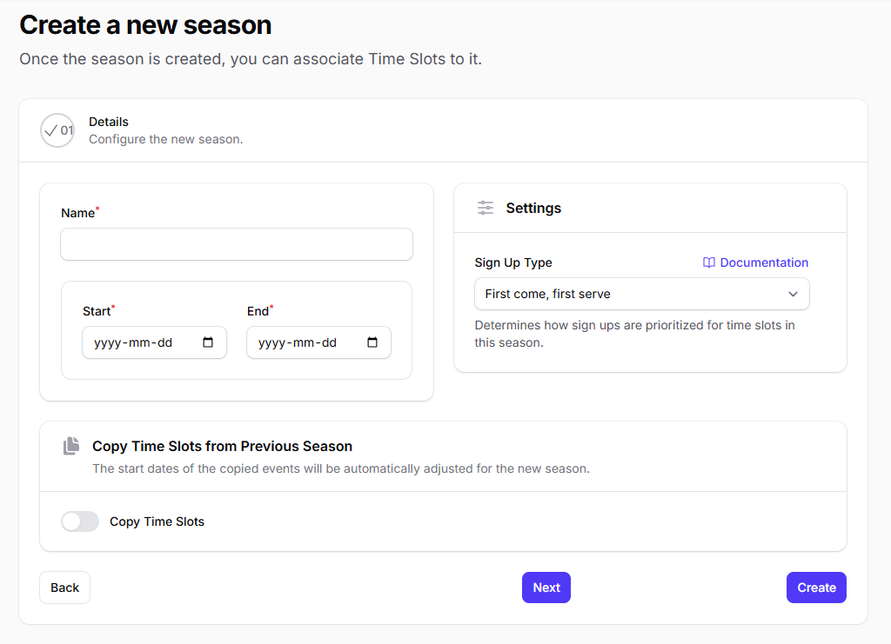

# Create a new season

To create a new season, visit the Seasons page from the administration panel:

Click the "New Season" button:

!!! info "Season Duration"

    The season "Start" and "End" dates cannot overlap with another season.

