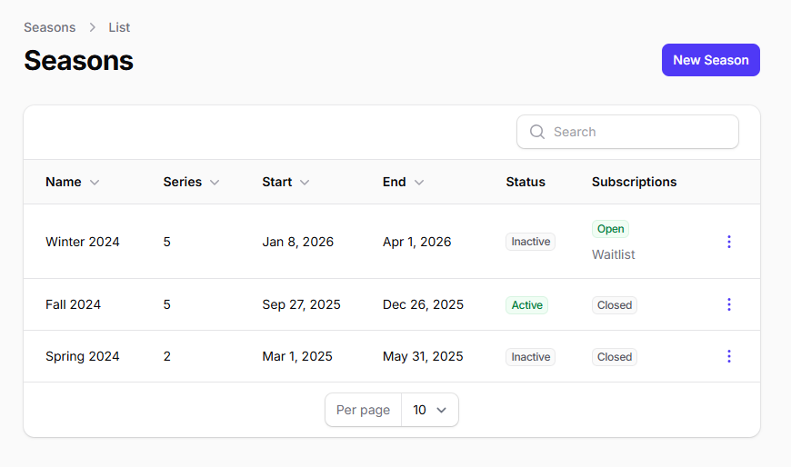
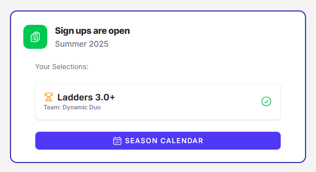
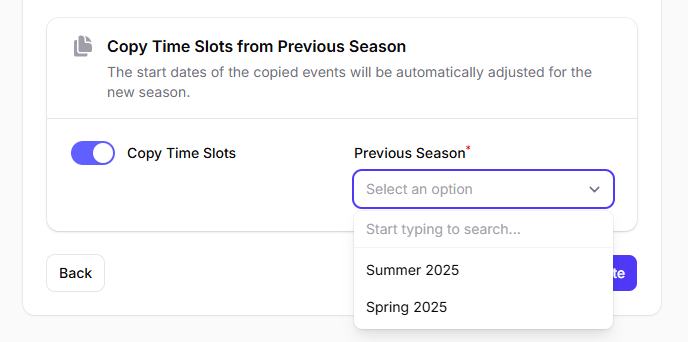
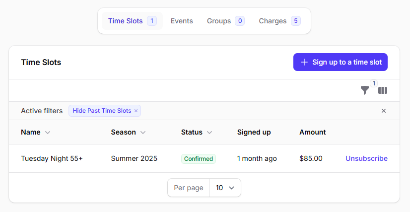

# :fontawesome-regular-sun: Overview

Seasons allow members to subscribe to weekly time slots before the season starts. This feature enables clubs to manage recurring events and collect payments in advance.

!!! tip "Create a new season"

    For help on creating a new season, visit the page [Create a new season](create-season.md)

## Introduction

### Open Season Sign Ups

When a season sign ups are open, members cannot subscribe to individual events directly from the regular schedule. All sign ups for events within that season must be made through the **Season Calendar**. This is to ensure members commits to entire time slots for the season, rather than picking and choosing individual dates.

!!! info "Season Calendar"
    To learn more about time slot selection workflows and registration types (First Come, First Serve vs Waitlist), see the [Season Calendar](season-calendar.md) page.

 * Action: Members must navigate to the Season Calendar.

 * Outcome: Signing up to a time slot from the Season Calendar subscribes the member to all events within that time slot for the entire season.

### Closed Season Sign Ups

When season sign ups are closed for the active or upcoming season, members have more granular control over event participation, but with specific limitations.

 * **Events a member already signed up for to via the Season Calendar**: A member can freely join and withdraw from these individual events.

 * **Events a member didn't sign up for to via the Season Calendar**: A member can only join these events if they are allowed to substitute (Drop-in).

## Creating Seasons

To create a new season:

1. Navigate to the Administration panel
2. Go to the Seasons page
3. Create a new season with the desired start and end dates

!!! tip "Create from previous season"
    When creating a new season, you can copy time slots from a previous season to save time.

    

## Assigning Time Slots to Seasons

Once you have created a season, you can assign time slots to it.

!!! note "Time slot cost"
    From the season page, you can set the cost that members will have to pay to subscribe to each time slots.

!!! tip "Season Deals"
    From the season page, you can also create **Season Deals**. Season Deals are rebates that are automatically applied when a member selects specific combinations of time slots from the Season Calendar. This allows clubs to offer discounts or incentives for members who commit to certain time slots together.

## Opening Season Sign Ups

To allow members to subscribe to the upcoming season time slots:

1. Go to the Administration
2. Navigate to the Seasons page
3. Toggle on the "Sign Ups" option for the upcoming season

Once season sign ups are open, members will see a new section in their dashboard. See [Season Calendar](season-calendar.md) for more info.

### Manually subscribe a member

Some members may not be able to use the platform to sign up for time slots themselves.
Administrators can manually register these members from the administration panel:

1. Go to the **Members** page.
2. Select the member from the table.
3. Scroll to the bottom and open the **Time Slots** tab.
4. Manually sign up the member for the desired Time Slot.

!!! info "Time slot cost"
    If there is a sign-up cost for the selected time slot, the member will be charged as if they had signed up through the pre-season calendar.
