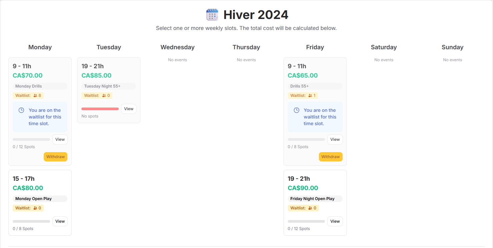

# :material-calendar: Season Calendar

The Season Calendar is a powerful feature of PickleTime that allows members to select their desired time slots for the upcoming season in one streamlined workflow. This is typically done during the **Pre-Season** phase after administrators open sign ups for a season.

## Purpose

Instead of joining individual events one by one, members use the Season Calendar to sign up to entire recurring time slots for the full season. This ensures consistent participation and simplifies billing.

## Registration Types

There are two registration modes supported by the Season Calendar. Administrators select the mode per time slot.

### 1. First Come, First Serve

In this mode:

- A member selects time slots from the Season Calendar.
- Upon confirming their selection, each signup is immediately confirmed.
- The member is charged right away for the selected time slots (including any Season Deals that may apply).
- The member is added as a participant to all corresponding events across the entire season.

!!! success "Immediate Confirmation"
    Members secure their spot instantly and appear in participant lists for all future events in the chosen series.

### 2. Seniority Priority

In this mode:

- A member selects time slots and confirms their choices.
- They are placed on a **waitlist** for each selected time slot instead of being confirmed immediately.
- The member is **not charged** until an administrator confirms (activates) the signup.
- Administrators can review and prioritize signups manually—helpful for clubs that allocate spots based on seniority, rating, or tenure.
- Members can view:
    - Who else is on the waitlist
    - Their current rank/position in the waitlist
- Once confirmed and activated, the member is charged and added as a participant to all future events in the selected time slot.

!!! warning "Season Deals Disabled"
  Season Deals do not apply in Seniority Priority mode. Rebates are only calculated for time slots using the **First Come, First Serve** registration type.

!!! info "Transparent Waitlist"
    The waitlist offers visibility and fairness: members know where they stand and can plan accordingly.

## Member Workflow

1. Navigate to the Season Calendar (prompted from the dashboard when pre-season sign ups are open).
2. Select one or more desired time slots.
3. Review the automatically calculated total cost (including rebates from Season Deals, if applicable).
4. Confirm selections.
5. Depending on registration type:
   - First Come, First Serve: Spots are confirmed immediately and charges applied.
   - Seniority Priority: Signup enters waitlist; pending admin activation.

## Administrator Workflow

Administrators manage season signups from the season management area:

- Open/close pre-season sign ups.
- Set per-time-slot cost and define Season Deals for bundles.
- Choose registration type (first come vs seniority priority) per time slot.
- For Seniority Priority:
  - View waitlists and member ranks.
  - Activate signups (which triggers charging and full-season event enrollment).
  - Optionally reorder or remove entries (if supported by club policy).

## Charging Logic Summary

| Mode | When Charged | Participant Enrollment | Visibility |
|------|---------------|------------------------|------------|
| First Come, First Serve | Immediately on confirmation | Instant for all season events | N/A (no waitlist) |
| Seniority Priority | When admin activates signup | After activation | Waitlist + rank visible |

## Season Deals

Season Deals provide automatic rebates when a member selects qualifying combinations of time slots—but only for time slots using **First Come, First Serve** registration.

!!! info "Availability"
    
    Season Deals are ignored for time slots configured with **Seniority Priority**.

If a member selects eligible combinations (all in First Come, First Serve mode), the discounted total is shown prior to confirmation.

## Waitlist Details (Seniority Priority)

- Each time slot maintains its own ordered waitlist.
- Rank changes dynamically as admins confirms sign ups.
- Members can withdraw from a waitlist at any time.
- No charges are applied while the member is on the waitlist.

## After Activation / Confirmation

Once a signup is activated (or confirmed directly in First Come, First Serve mode):

- The member appears in the participant list for all events in that time slot for the rest of the season.
- Billing ledger reflects the transaction.
- Drop-in rules may still apply for events outside subscribed time slots.

## Manual Overrides

Administrators can manually sign up members to time slots from the member administration page. These manual actions behave as if the member had used the Season Calendar (including charging logic).

## Best Practices

- Use Seniority Priority for high-demand time slots to ensure fair allocation.
- Communicate waitlist timelines to members.
- Define clear Season Deals to encourage broader participation.
- Close pre-season sign ups before the first week starts to finalize series rosters.

## Related

- [Seasons Overview](index.md)
- [Event Series Management](../events/events-management.md)

